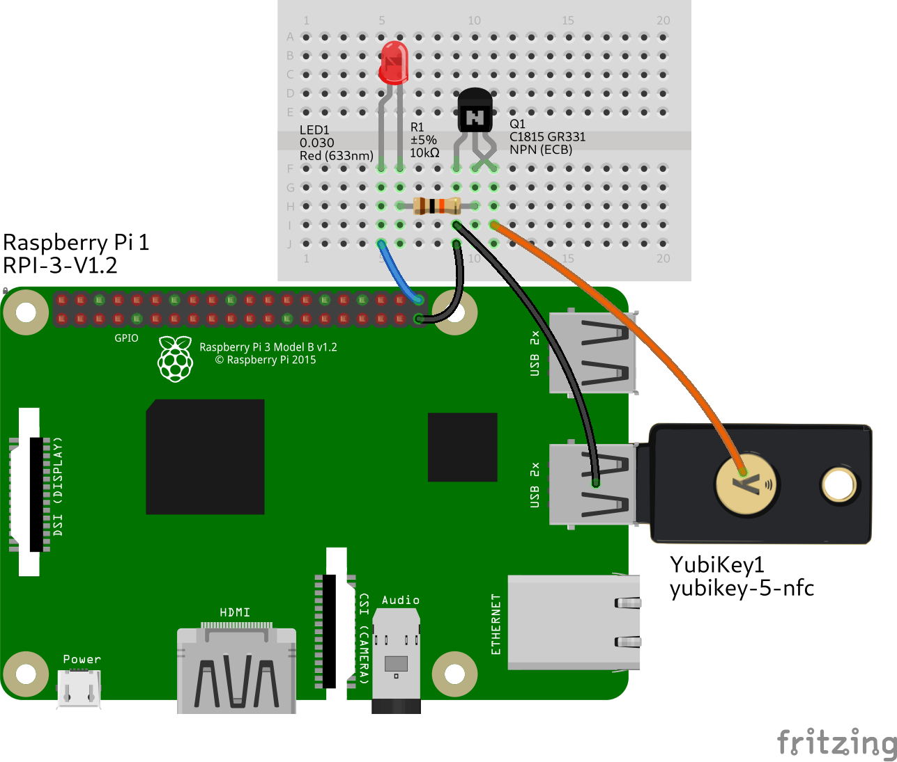

# YubiPi

YubiPi is project for triggering a YubiKey from software and providing the
means to do so remotely. This takes the burden of having to bring it with 
you and pressing the button manually from you, and enables you to easily
automate anything that requires a One-Time Password from the YubiKey.

## Hardware

### What you need
- A YubiKey with a capacitive touch sensor (like a YubiKey 5 NFC)
- A Raspberry Pi with a matching free USB port (like a Raspberry Pi 3B v1.2)
- A breadboard, a few wires, a little bit of tinfoil and tape
- A transistor with a low output capacitance (like a C1815)
- A 10 kOhm resistor and optionally a LED

### Triggering Circuit

