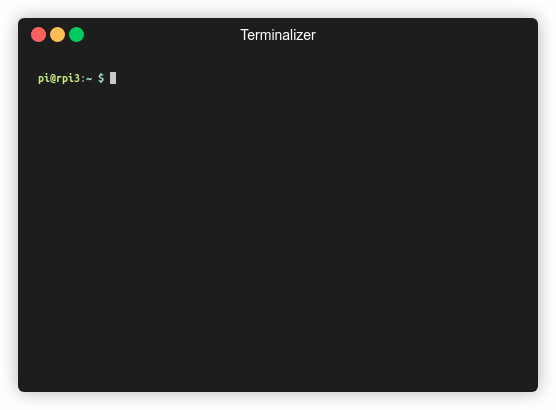

# YubiPi

YubiPi is project for triggering a YubiKey from software and providing the
means to do so remotely. This takes the burden of having to bring it with 
you and pressing the button manually from you, and enables you to easily
automate anything that requires a One-Time Password from the YubiKey.



## Hardware

### Triggering Capacitive Touch Sensors
YubiKeys use capacitive touch sensors. Those measure the capacitance of a
capacitor of which the contact plate is part of. The touch with you finger
causes a measurable change thus triggers the sensor.

There are multiple ways to replicate this. Touching the contact pad with a
large conductive object or grounding the pad shortly could be realized with an
actuator or a relay. Both those components however are a bit clunky and also
rarely part of the electronic hobbyists assortment.

A transistor-based solution seems much more elegant but has a catch.
Transistors are capacitive components which means even in a cut-off state
they will pull some charge from the contact plate. This can easily disturb
the measurement process enough so that the touch sensor won't trigger when
the transistor is activated.

The circuit we are aiming for is this:


The NPN transistor is switched with the Raspberry Pi's GPIO and the collector
of it is used to pull the contact plate to ground. In this case the
collector-emitter or output capacitance of the transistor is key. It needs to
be very low so it does not pull too much charge in the cut-off state.

### What you need
Unfortunately the popular
[BC337](https://www.futurlec.com/Datasheet/Transistor/BC337.pdf)
has an output capacitance of 15 pF. This is too much for triggering the
YubiKey. A [C1815](https://www.futurlec.com/Datasheet/Transistor/C1815.pdf)
with only 2 pF should work just fine.

All in all you will be needing the following components to build the circuit:

- A YubiKey with a capacitive touch sensor (like a YubiKey 5 NFC)
- A Raspberry Pi with a matching free USB port (like a Raspberry Pi 3B v1.2)
- A breadboard, a few wires, a little bit of tinfoil and tape
- A transistor with a low output capacitance (like a C1815)
- A 10 kOhm resistor and optionally a LED

### Triggering Circuit
The following picture shows an example of how the circuit could be arranged on
a breadboard.


Note that in case of a C1815 transistor the contact order is ECB (Emitter,
Collector, Base).

The touch sensor plate of the YubiKey is connected to the transistors
collector. Make sure to have a large contact area between wire and the plate
with the tinfoil and some tape.

For good measure you might also want to ground the USB ports casing. Here you
can also use some tinfoil and tape.

## Software

After the hardware part is done, you can login into your Raspberry Pi to
install the software. First clone this repository to an arbitrary location
and enter the folder.

### Installation
The Python dependencies are listed in `requirements.txt`, so you can install
them with:
```bash
sudo pip3 install -r requirements.txt
```
Now link the YubiPi script into a binary folder to make it available via the
`PATH` variable.
```bash
sudo ln -s "$(pwd)/yubipi.py" /usr/local/bin/yubipi
```

### CLI Mode
If you connected the triggering circuit to GPIO 21 (pin 40) you should now be
able to get an OTP with:
```bash
yubipi
```
If you connected the trigger to different pin, you can specify this with the
`-p/--pin` argument:
```bash
yubipi -p 40
```
You can find the pinout for the Raspberry Pi [here](https://pinout.xyz).

The program tries to autodetect the YubiKey. In case multiple are connected
you will be prompted to choose one. To specify it from the start, especially
in cases where the program is unable to identify the YubiKey from the device
name, use the `-d/--device` argument:
```bash
yubipi -d /dev/input/event0
```
To manually identify the YubiKey's input device you can use this command:
```bash
for evdev in $(find /sys/class/input/event* -exec basename {} \;);
    do echo "/dev/input/${evdev} : $(cat /sys/class/input/${evdev}/device/name)";
done
```
For more info on the command line interface check the help with help with
`-h/--help`.

### API Mode
To start the API server use the `-s/--server` argument:
```bash
yubipi -s
```
Everything mentioned about setting the pin and input device applies in this
mode as well.

By default the server will be started on localhost and port 5000. You can
query it for an OTP locally:
```bash
curl http://127.0.0.1:5000/
```
If you want it to listen on a different device and port use the `-H/--host`
and `-P/--port`. For example if you want it to listen on any device on
port 5050:
```bash
yubipi -s -H 0.0.0.0 -P 5050
```
In this case you can also call the server on the local network.

To secure the API endpoint with token authentication you can specify tokes
with the `-t/--token` option:
```bash
yubipi -s -t secrettoken1 secrettoken2
```
Then you have to authenticate when doing a query with one of the given tokens:
```bash
curl http://127.0.0.1:5000/ -H 'X-Auth-Token: secrettoken2'
```

### SystemD Service

### HTTPS
